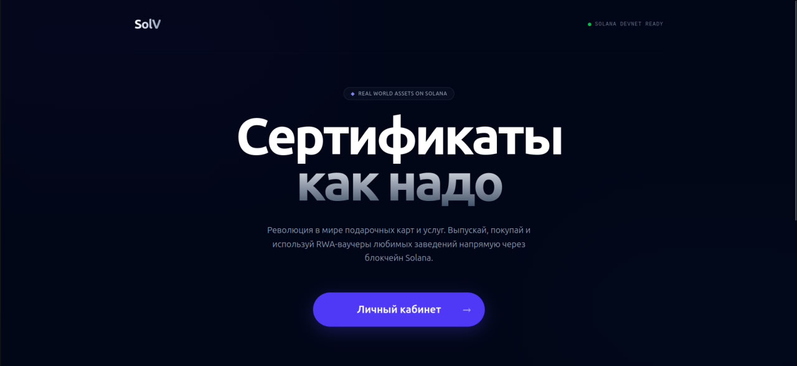

# SolV - RWA Voucher Infrastructure

[](https://github.com/Segaoneboy/SolV/actions/workflows/ci.yml)
[](LICENSE)
[](https://solana.com)
[](https://colosseum.org)

> **SolV** is a decentralized platform for tokenizing Real-World Assets (RWA), specifically programmable vouchers, tickets, and service credits. We bridge the gap between physical retail and Solana's liquidity.

[Live Demo](#) · [Video Walkthrough](#) · [Docs](docs/) · [Colosseum Submission](#)

---



---

## Submission to 2026 Solana National Hackathon

| Name | Role | Contact |
|------|------|---------|
| Sergey Peressypkin | Founder & Lead Engineer | [Telegram](https://t.me/sega_oneboy) · [GitHub](https://github.com/Segaoneboy) |

---

## Problem and Solution

### 1. High Entry Barrier
- **Problem:** RWA platforms often require complex wallet setups, preventing mass adoption.
- **SolV:** Uses **Privy** for "Invisible Web3" onboarding via Google/Email, creating secure embedded wallets instantly.

### 2. Illiquid Real-World Assets
- **Problem:** Traditional vouchers are locked in private databases and cannot be easily traded or verified.
- **SolV:** Every voucher is an on-chain **PDA**, ensuring transparency, true ownership, and secondary market potential.

### 3. Lack of Trust
- **Problem:** Users fear centralized database breaches, while merchants face high fees and slow settlements.
- **SolV:** Funds are secured in a **Solana Vault (Escrow)**. Merchants get instant settlement (<1s) and minimal transaction costs.


---

## Why Solana

- **Parallel Scalability** — By utilizing Program Derived Addresses (PDAs) for every voucher, SolV leverages Solana’s Sealevel engine to process thousands of mints and redemptions in parallel without state contention.
- **Retail-Grade Finality** — Solana’s 400ms slot times enable a "Scan-to-Redeem" experience that rivals traditional credit cards, ensuring instant on-chain confirmation at the point of sale.
- **Ecosystem** — Integration with the Solana Mobile Stack (SMS) and Seed Vault allows merchants to sign redemptions on devices like Saga or Seeker with hardware-secured private keys.
- **Composability** — Built on the Anchor Framework, SolV’s escrow and minting logic can seamlessly compose with Solana’s DeFi ecosystem for future voucher-backed lending or secondary trading.
- **Cost** — Fees as low as $0.00025 and future State Compression (cNFTs) make it economically viable to tokenize low-cost RWA assets, such as a $5 coffee or a single gym session.

---

## Summary of Features

- Hybrid Authentication — Seamless onboarding via Privy, enabling Google/Email login with secure, non-custodial embedded wallets.
- On-chain Escrow (Vaults) — Funds are securely locked in the Solana program until the voucher is redeemed or the terms are met.
- Atomic Redemption — A secure "Burn-to-Redeem" logic that prevents double-spending and ensures instant merchant verification.
- Public-First Marketplace — Browse and discover RWA vouchers via Read-Only RPC calls without the need to connect a wallet initially.
- 
PDA-based State Management — Every voucher is a unique Program Derived Address, ensuring isolated state and scalable parallel processing.
- Merchant Dashboard — A specialized interface for businesses to mint vouchers, monitor real-time redemption velocity.
- Real-Time Analytics — Direct on-chain monitoring of voucher life-cycles, providing businesses with instant data on customer engagement.

---

## Tech Stack

| Layer | Technology |
|-------|----------|
| On-chain programs | Rust · Anchor Framework |
|Authentication / Wallets| Privy (Embedded Wallets & Social Auth)|
| Frontend | React · Next.js · TailwindCSS |
| SDK / Client | TypeScript · @solana/web3.js· @coral-xyz/anchor |
| Testing | Anchor Tests · Mocha |
| Environment | Solana CLI · Devnet Deployment |


---

## Architecture

```
┌─────────────┐      ┌──────────────────────┐      ┌──────────────────┐
│   Merchant  │      │       SolV App       │      │  Solana Program  │
│ (Issuance)  │────▶ │   (Business Dash)    │────▶ │  (Voucher State) │
└─────────────┘      └──────────┬───────────┘      └─────────┬────────┘
                                │                            │
┌─────────────┐      ┌──────────▼───────────┐      ┌─────────▼────────┐
│    User     │      │   Public Gateway     │      │   Vault & PDA    │
│  (Buyer)    │────▶ │   (No-auth View)     │────▶ │   (Fund Escrow)  │
└─────────────┘      └──────────────────────┘      └──────────────────┘
```

See [docs/architecture.md](docs/architecture.md) for full component breakdown.

---

## Quick Start

**Prerequisites:** Node.js 18+, Rust, Anchor CLI, Solana CLI

```bash
# Clone the repository
git clone https://github.com/Segaoneboy/SolV.git
cd SolV

# Install dependencies
npm install

# Build Solana programs
anchor build

# Run tests
anchor test

# Start frontend
cd frontend && npm run dev

# Copy environment variables
cp .env.example .env.local

# Launch the development server
npm run dev

Note: To enable Privy Authentication, make sure to add your NEXT_PUBLIC_PRIVY_APP_ID to the .env.local file.
```

---

## Roadmap

- [x] Full-Cycle Anchor Program: On-chain logic for Minting, Escrow, and Atomic Redemption via PDAs.
- [x] Unified RWA Marketplace: High-performance Next.js platform for browsing and purchasing.
- [x] Invisible Web3 (Privy): Social/Email onboarding with secure embedded wallets.
- [x] Merchant Dashboard: Interface for voucher issuance and real-time monitoring.
- [ ] Secondary Market: Built-in DEX for trading and reselling unused RWA vouchers.
- [ ] Solana Mobile Integration: Native dApp support using SMS and Seed Vault security.
- [ ] State Compression (pNFTs): Scaling to millions of vouchers with near-zero rent costs.

Full roadmap: [docs/roadmap.md](docs/roadmap.md)

---

## Resources

- [Project Presentation](#)
- [Video Demo](#)
- [Live Application](#)
- [Telegram](https://t.me/sega_oneboy)

---

## License

MIT — see [LICENSE](LICENSE)
